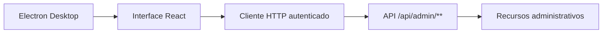

<div align="center">

# CollabResearch Admin Desktop

**Painel administrativo desktop para gerenciamento da plataforma CollabResearch.**

<p>
  
  
  
  
</p>

Uma interface dedicada a operacao, moderacao e governanca do ambiente academico.

</div>

---

## Visao geral

O **CollabResearch Admin Desktop** e a aplicacao administrativa da plataforma, construida com Electron, React, Vite e TypeScript. Ela centraliza tarefas operacionais em um aplicativo desktop e consome exclusivamente endpoints protegidos de administracao.

| Administracao | Operacao | Governanca |
| --- | --- | --- |
| Usuarios, alunos, orientadores e administradores | Projetos, oportunidades, inscricoes e documentos | Dashboard, relatorios, auditoria e configuracoes |

## Fluxo da aplicacao



## Recursos

- Dashboard com indicadores e atividades administrativas recentes.
- Gestao de perfis: usuarios, alunos, orientadores e administradores.
- Acompanhamento de projetos, oportunidades e inscricoes.
- Moderacao de documentos e consulta de relatorios.
- Auditoria de acoes e edicao de configuracoes do sistema.
- Controle de acesso restrito ao perfil `ADMIN`.

## Estrutura

```text
tcc-desktop/
|-- electron/             # Processo principal e preload do aplicativo
|-- src/
|   |-- app/              # Providers e roteamento
|   |-- components/       # Layout, dashboard e componentes reutilizaveis
|   |-- features/         # Modulos administrativos por dominio
|   |-- lib/              # API client, permissoes e utilitarios
|   |-- mocks/            # Dados auxiliares para desenvolvimento
|   `-- styles/           # Estilos globais
|-- .env.example          # Exemplo de configuracao local
|-- package.json          # Dependencias e scripts
`-- vite.config.ts        # Configuracao da aplicacao desktop
```

## Inicio rapido

### Pre-requisitos

- Node.js e npm instalados.
- Backend CollabResearch em execucao com um administrador bootstrap configurado.

### Configuracao

```bash
git clone https://github.com/dudumatto/tcc-desktop.git
cd tcc-desktop
npm install
```

Crie o arquivo de ambiente a partir do exemplo:

```bash
cp .env.example .env
```

No Windows PowerShell:

```powershell
Copy-Item .env.example .env
```

Configure a URL da API quando necessario:

```env
VITE_API_URL=http://localhost:8080/api
```

Inicie o ambiente de desenvolvimento:

```bash
npm run dev
```

## Backend hospedado no Render

Ao executar com `npm run dev`, o desktop pode consumir o backend publicado sem iniciar uma API local. Depois de implantar o repositorio backend como um Web Service no Render, copie a URL publica disponibilizada pela plataforma e configure o arquivo `.env` usando a proxy do Vite:

```env
DESKTOP_API_PROXY_TARGET=https://seu-servico.onrender.com
```

A interface continua chamando `/api` no servidor local de desenvolvimento, e a proxy encaminha as requisicoes ao Render. Assim, o backend nao precisa liberar origens locais no CORS de producao. Em um Web Service gratuito, a primeira requisicao apos um periodo sem uso pode demorar enquanto a instancia e reativada.

Em uma versao Electron gerada com `npm run build` e aberta com `npm start`, as requisicoes sao enviadas pelo processo principal para `https://tcc-backend-jqod.onrender.com/api`. Isso permite que o aplicativo distribuido use o backend hospedado sem liberar a origem local do Electron no CORS.

Para executar a versao gerada contra um backend local, informe a URL antes de iniciar:

```powershell
$env:DESKTOP_API_URL='http://localhost:8080/api'
npm start
```

## Scripts

| Comando | Descricao |
| --- | --- |
| `npm run dev` | Inicia Electron e Vite em modo de desenvolvimento. |
| `npm run build` | Valida tipos e gera o aplicativo web/Electron. |
| `npm run preview` | Visualiza o build da interface. |
| `npm run start` | Executa o aplicativo Electron previamente gerado. |

## Acesso administrativo

O desktop utiliza somente rotas protegidas sob `/api/admin/**`. Contas com perfil `ALUNO` ou `ORIENTADOR` nao possuem acesso ao painel administrativo.
